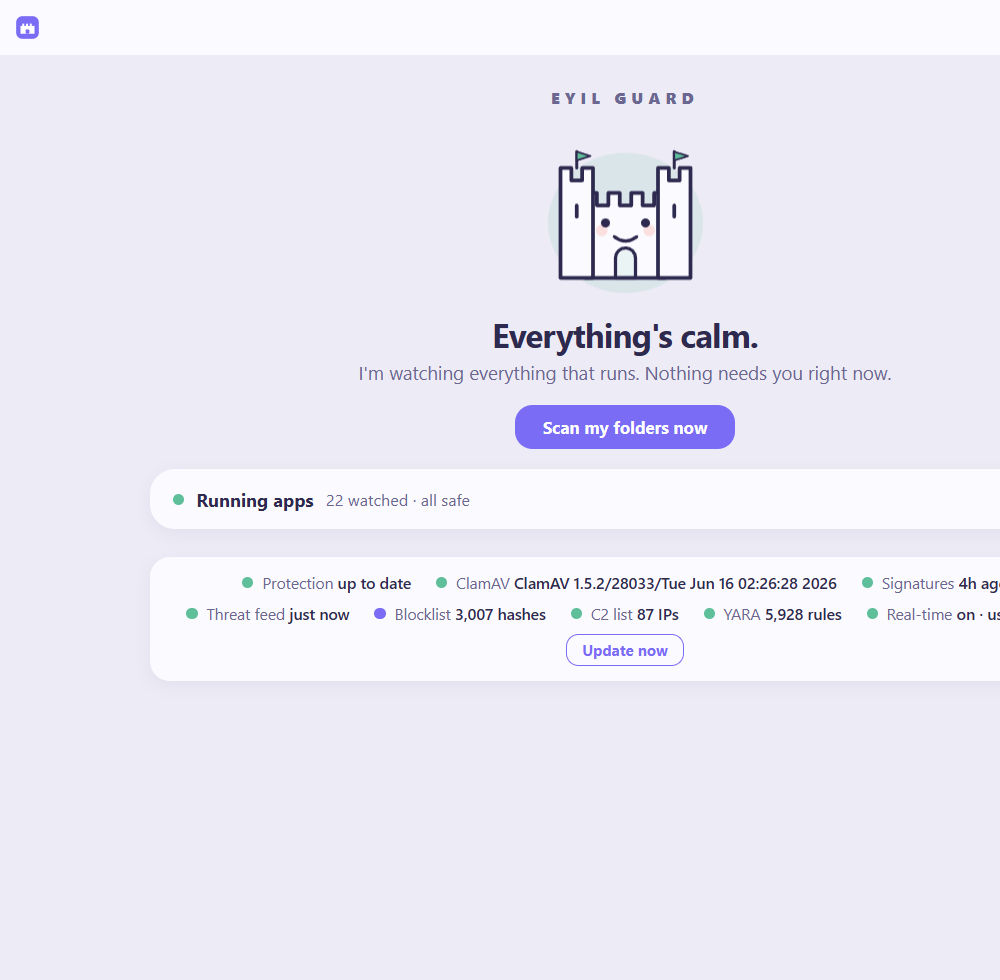
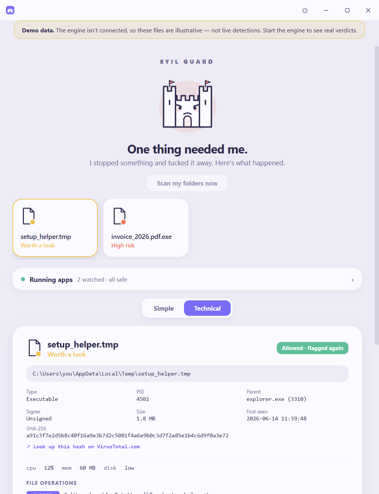
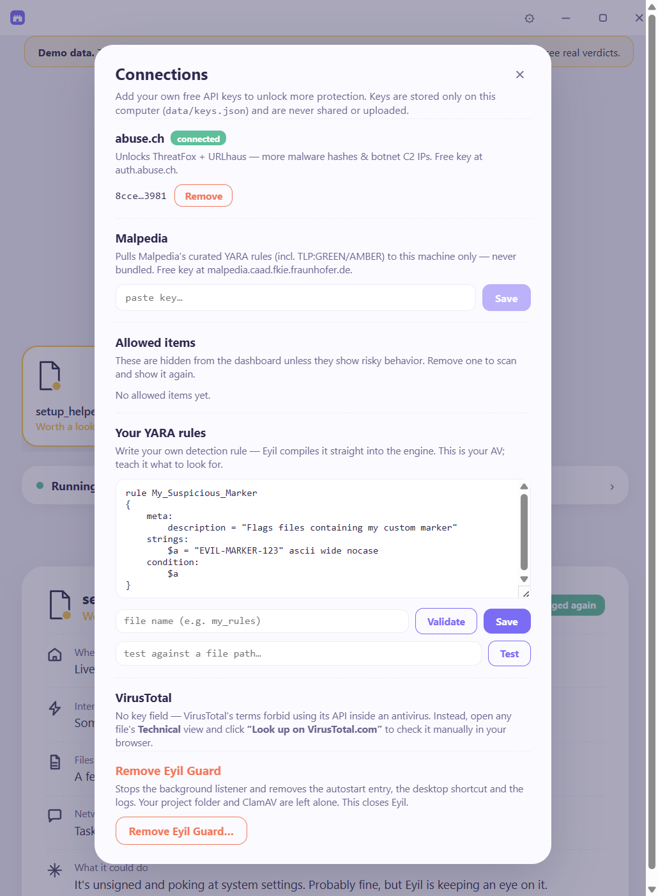
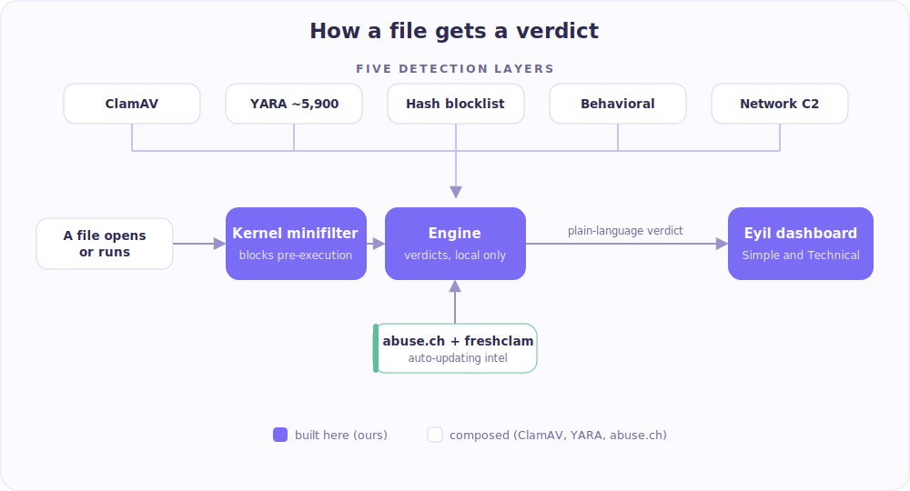

# Eyil Guard

Eyil Guard is an open-source endpoint protection tool for Windows. Every file it inspects
gets a short, plain-language verdict, and that verdict is one click away from the full
technical record: file path, hashes, network connections, and the raw event log. It does
not try to out-detect commercial antivirus. It composes existing open-source components
(ClamAV, YARA, the abuse.ch feeds) and adds the Windows integration, the behavioral rules,
and the interface.

The user-space parts (detection, real-time monitoring, the dashboard, automatic updates)
work today. The kernel driver builds and blocks on a test virtual machine, but it is
test-signed and VM-only, not yet code-signed for general use. This is a work in progress.

<p align="center">
  
</p>

## Features

- Detection from five sources: ClamAV signatures, about 5,900 YARA rules (community
  signature-base, 12 built-in rules, and any you write), an abuse.ch hash blocklist,
  behavioral rules (ransomware, execution from temp directories, office applications
  spawning shells), and checks against connections to known command-and-control servers.
- A live process inventory. It tracks programs that are actually running, not only files on
  disk, and shows each one with its verdict and process ID. Flagged processes can be
  terminated from the dashboard.
- Automatic updates with visible health. Threat intelligence refreshes on a schedule, and
  the dashboard always shows when each source last updated. A failed fetch is reported as
  stale rather than current.
- Two views per file. A plain summary (where it lives, whether it uses the network, what it
  touches) and a full technical view (path, process ID, parent process, signer, size,
  SHA-256, CPU and memory, and a link to look the hash up on VirusTotal manually).
- Extensible. Write your own YARA rules in the app, and add free API keys (abuse.ch,
  Malpedia) for larger feeds. Rules and keys stay on the machine.
- Kernel pre-execution blocking. A file-system minifilter intercepts a file open, asks the
  engine for a verdict, and blocks the open before it completes. Verified on a Windows VM
  (test-signed, narrow scope).
- One local process. The engine serves both the API and the dashboard window. Nothing is
  exposed beyond 127.0.0.1.

## Screenshots

The screenshots below use demo data so the threat states are visible. Against a live system
the interface is identical.

The usual state, all clear:



A file in technical view:



Settings: feed keys, the allow list, and a YARA rule editor:



## How it works



A file open is intercepted by the kernel minifilter, which asks the local engine for a
verdict. The engine runs the file through the five detection sources, which are kept current
by automatic updates, returns the result to the kernel (which can block the open), and shows
it in the dashboard.

## Requirements

- Windows and Python 3.11 or newer.
- ClamAV with the clamd daemon. This is optional. Hash, behavioral, and network detection
  work without it, and the dashboard reports ClamAV as not running.
- Node.js, to build the dashboard.

## Install

The setup script installs dependencies, builds the dashboard, sets up ClamAV, pulls the
first feeds, and registers a background listener that starts at logon. It does not require
administrator rights.

```powershell
powershell -ExecutionPolicy Bypass -File install.ps1
```

Run it:

```powershell
python -m eyil              # open the window
python -m eyil --no-window  # run the background listener only
```

Remove everything with `uninstall.ps1`.

## Standalone executable

```powershell
powershell -ExecutionPolicy Bypass -File build_exe.ps1
```

This produces `dist\Eyil\Eyil.exe`, a windowed build with the dashboard and the full YARA
ruleset included. ClamAV is installed separately. Runtime data (feeds, keys, quarantine) is
written to `%LOCALAPPDATA%\EyilGuard\data` on first run.

## Project layout

```
engine/     Python engine: API, scanners, behavioral rules, feeds, data models
driver/     Windows minifilter and the user-mode scanner bridge (built in a VM)
dashboard/  the dashboard (Vite and React)
eyil/       the desktop launcher (python -m eyil)
data/       feeds and runtime state
tools/      the original scanner prototype and helper scripts
```

## What is borrowed and what is built here

| Component | Source |
|---|---|
| Signature engine and database | ClamAV and freshclam (borrowed) |
| Pattern matching | YARA and community rules (borrowed) |
| Hash and indicator feeds | abuse.ch: MalwareBazaar, ThreatFox, URLhaus (borrowed) |
| Kernel minifilter | this repository |
| Engine, verdicts, and API | this repository |
| Behavioral correlation | this repository |
| Dashboard | this repository |

VirusTotal's public API may not be used inside antivirus products, so it is never a runtime
dependency. The dashboard links to virustotal.com for manual lookups instead.

## Status

Working today:

- Detection: ClamAV, the abuse.ch hash blocklist, about 5,900 YARA rules, behavioral rules,
  and network command-and-control checks.
- Real-time: a user-mode file monitor and the live process inventory.
- Dashboard: connected to the engine, both views, allow, quarantine, and un-allow actions,
  an allow list, and a YARA rule editor.
- Packaging: a native window, an installer, a background listener, and a standalone executable.

Kernel driver: it builds, test-signs, loads, and blocks on a Windows VM. A file under its
scan scope is intercepted, hashed, matched against the blocklist, and the open is blocked
with STATUS_VIRUS_INFECTED. It is test-signed and VM-only. See `driver/BUILD_DRIVER.md`.

Not done yet: code-signing the executable and the driver, and an always-on system service.
Until those exist, run Eyil Guard alongside your existing antivirus rather than as a
replacement.

## Threat intelligence and attribution

Eyil Guard uses the free bulk exports from [abuse.ch](https://abuse.ch) (now part of
Spamhaus): MalwareBazaar hashes and Feodo Tracker command-and-control IPs, under abuse.ch's
fair-use terms for non-commercial use. The query APIs (ThreatFox, URLhaus) require a free
key from [auth.abuse.ch](https://auth.abuse.ch). Community YARA rule sets such as
[Neo23x0/signature-base](https://github.com/Neo23x0/signature-base) are licensed under the
Detection Rule License 1.1 and are included as data with attribution.

## License

GPLv3. See [LICENSE](LICENSE).
